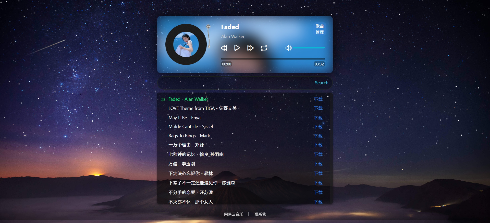

# 在线音乐播放器

<p align="center">
  
</p>

## 这是一个在线音乐播放器，支持GitHub仓库，R2存储桶，云盘，API等歌单，支持可批量添加或删除，支持多种音乐格式: mp3/wav/flac/m4a





---


# 📦 多平台部署

本项目支持多平台部署：

| 部署平台 |
|---------|
| Serv00 |
| Claw Cloud |
| Cloud Cat |
| HuggingFace Spaces |
| Koyeb |
| Render |
| Docker |


---


# Serv00平台部署

- 添加域名时选择类型为Node.js
- 上传项目文件压缩包到public_nodejs文件夹内解压
- SSH里cd到public_nodejs文件夹安装依赖后重启站点
```
cd domains/你的域名/public_nodejs
```
```
npm install
```
```
devil www restart 你的域名
```


---


# Docker容器平台部署

## Github Actions构建镜像或者直接使用我的Docker镜像

```Dockerfile
FROM ghcr.io/zxlwq/player:latest
```
```Dockerfile
FROM zxlwq/player:latest
```


---


# Hugging Face Spaces部署
## 使用 [player-api.yml](.github/workflows/player-api.yml) 创建 Spaces

1. **创建抱脸Access Tokens（需要写权限）**

2. **运行GitHub Actions**

3. **自动创建 Spaces**
   - 脚本会自动创建 Hugging Face Spaces
   - 添加所有必要的环境变量

## docker-compose.yml
```bash
version: '3'

services:
  music-player:
    image: zxlwq/player:latest
    ports:
      - "3000:3000"
    volumes:
      - music-data:/app/music
    environment:
      - PORT=3000
      - PASSWORD=admin
      - ACCOUNT_ID=
      - ACCESS_KEY_ID=
      - SECRET_ACCESS_KEY=
      - GIT_REPO=
      - GIT_TOKEN=
      - GIT_URL=
      - WEBDAV_URL=
      - WEBDAV_USER=
      - WEBDAV_PASS=
    restart: unless-stopped

volumes:
  music-data:
```


---


# VPS部署

## 源代码部署
* 安装nodejs环境
```
apt-get update -y
curl -fsSL https://deb.nodesource.com/setup_lts.x | sudo -E bash - && install nodejs
```
* 部署主体项目
```
apt install git screen -y
git clone https://github.com/zxlwq/Player
cd Player && rm -rf Dockerfile README.md .github
npm install
screen npm start 
```


---


# 环境变量说明

| 环境变量 | 类型 | 说明 | 示例 |
|---------|------|------|------|
| `PASSWORD` | 必需 | 管理密码 | `admin` |
| `ACCOUNT_ID` | 可选 | Cloudflare账户ID | `abc123def456` |
| `ACCESS_KEY_ID` | 可选 | R2 访问密钥ID | `your_access_key_id` |
| `SECRET_ACCESS_KEY` | 可选 | R2 秘密访问密钥 | `your_secret_access_key` |
| `GIT_REPO` | 可选 | GitHub仓库名（格式：owner/repo） | `zxlwq/music` |
| `GIT_TOKEN` | 可选 | GitHub Token | `ghp_xxxxxxxxxxxx` |
| `GIT_URL` | 可选 | GitHub 代理URL（用于中国大陆网络环境） | `https://proxy.example.com` |
| `GIT_PATH` | 可选 | GitHub仓库中音乐文件夹路径（默认为 `music`） | `public/music` |
| `WEBDAV_URL` | 可选 | WebDAV 地址 | `https://dav.example.com/` |
| `WEBDAV_USER` | 可选 | WebDAV 用户名 | `username` |
| `WEBDAV_PASS` | 可选 | WebDAV 密码 | `password` |
| `WEBDAV_PATH` | 可选 | WebDAV 云盘中音乐文件夹路径（默认为 `music`） | `zxlwq/music` |

**注意事项：**
- 创建R2 存储桶名称必需为 `music`
- GitHub仓库歌单路径可通过 `GIT_PATH` 环境变量配置（默认为 `music`）
- WebDAV 歌单文件夹路径可通过 `WEBDAV_PATH` 环境变量配置（默认为 `music`）


---


# 从R2 存储桶导入歌单

## 在歌曲管理中，点击"切换R2歌单"按钮，可以直接从R2 存储桶读取歌单并播放，需要配置以下环境变量：
- `ACCOUNT_ID` - Cloudflare账户ID
- `ACCESS_KEY_ID` - R2 访问密钥ID  
- `SECRET_ACCESS_KEY` - R2 秘密访问密钥

注意：R2 存储桶名称必需为 'music'


---


# 从GitHub仓库导入歌单

## 在歌曲管理中，点击"切换GitHub歌单"按钮，可以直接从GitHub仓库读取歌单并播放，需要配置以下环境变量：
- `GIT_REPO` - GitHub仓库名（格式：owner/repo，如：zxlwq/Player）
- `GIT_TOKEN` - GitHub Token
- `GIT_URL` - GitHub 代理URL（可选，用于中国大陆网络环境，如：https://proxy.example.com）
- `GIT_PATH` - GitHub仓库中音乐文件夹路径（可选，默认为 `music`，如：`public/music`）

## 注意：
- Git 分支已硬编码为 'main'
- 仓库歌单路径可通过 `GIT_PATH` 环境变量配置（默认为 `music`）
- 音频文件应放在仓库中 `GIT_PATH` 指定的文件夹下（如未配置，则为根目录的 `music` 文件夹）
- 如果配置了 `GIT_URL`，GitHub raw 链接会自动通过代理访问


---


# 从云盘导入歌单

## 在歌曲管理中，点击"切换云盘歌单"按钮，可以直接从云盘读取歌单并播放，需要配置以下环境变量：
- `WEBDAV_URL` - WebDAV 地址（如：https://dav.example.com/）
- `WEBDAV_USER` - WebDAV 用户名
- `WEBDAV_PASS` - WebDAV 密码
- `WEBDAV_PATH` - WebDAV 云盘中音乐文件夹路径（可选，默认为 `music`，如：`public/music`）

## 注意：
- WebDAV 云盘文件夹路径可通过 `WEBDAV_PATH` 环境变量配置（默认为 `music`）
- 音频文件应放在云盘中 `WEBDAV_PATH` 指定的目录下（如未配置，则为 `music` 目录）
- 支持的格式: mp3/wav/flac/m4a


```Dockerfile
FROM node:18-alpine

RUN apk add --no-cache git bash curl

WORKDIR /app

ARG GIT_TOKEN
ARG GIT_REPO

RUN rm -rf /app/* \
&& git clone https://${GIT_TOKEN}@github.com/${GIT_REPO}.git . \
&& npm install

EXPOSE 3000

CMD ["node", "app.js"]
```
